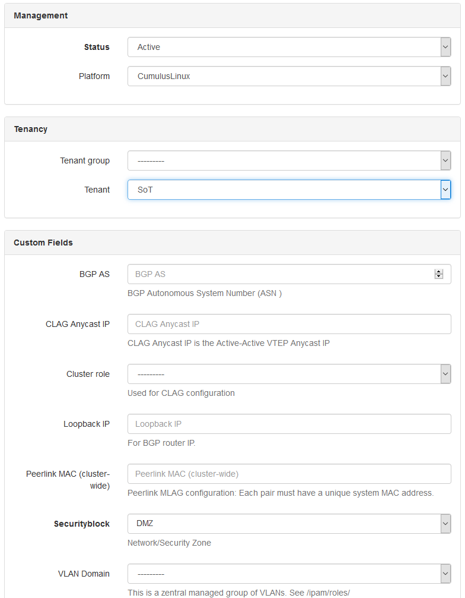
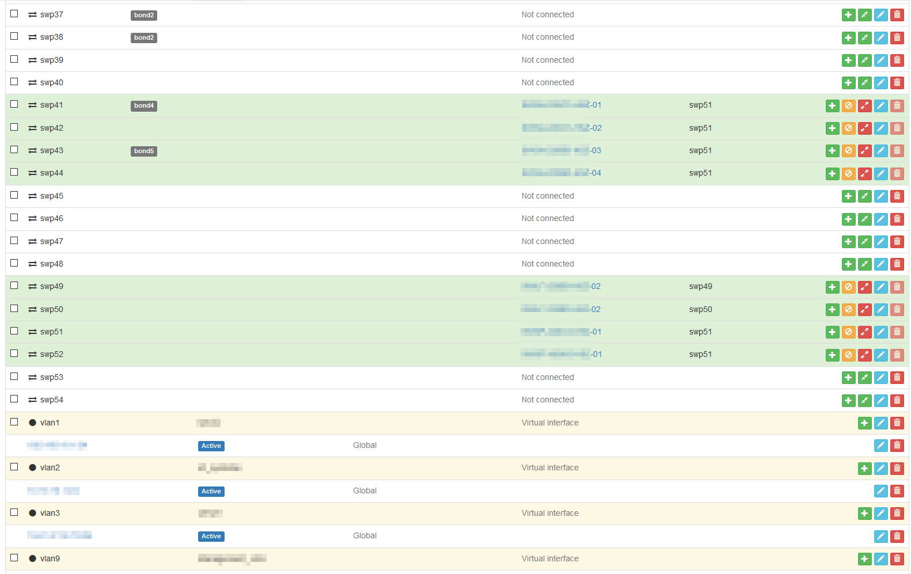

Netbox_joined_inventory (for network devices)
=============================================


Netbox_joined_inventory joins
[Netbox](https://github.com/digitalocean/netbox/) as source-of-truth for
the network configuration and
[Ansible](https://github.com/ansible/ansible/) as a automation
orchestrator.

Netbox_joined_inventory is a script that gathers data from a Netbox as
source-of-truth and stores the data as Ansible inventory, group_vars
and host_vars.

The Ansible inventory will not contain configuration data - most
configuration data is stored in host_vars YAML files.

Netbox_joined_inventory is not a *dynamic* inventory script for Ansible.
A dynamic inventory script would immediately propagate changes in Netbox
to Ansible. Instead netbox_joined_inventory generates variables files.

The generated files can be committed to a repository. That way
differences to the previous set of configuration files can be reviewed
before applying them via Ansible playbooks.

The benefits are clear: an audit trail, traceability, reproducibility,
the possibility to roll back and a clean separation between playbook
logic and sensitive config data.

The script is specialized for networking devices rather than servers. It
features the following functionality:

- Get an inventory of network devices from Netbox via API
  - Build host groups for Ansible. Condition configurable. E.g.
    Role(Spines/Leafs/Access), Platform, Network/Security zones, Site
  - Write to an Ansible inventory file. INI-like syntax.

- Get all interfaces for each network device
  - Write them to the host_vars files. YAML syntax.
  - Including interface name, form/speed, IP addresses, untagged VLANs

- Get configured VLANs for common device roles. All leafs in an network
  zone have the same VLAN/VXLAN configuration (see also
  [requirements.txt](requirements.txt))
  - Write VLANs to the host_vars files. YAML syntax.
  - VLAN, VXLAN vni, Anycast IP, CIDR, VRF

Target network architecture
===========================
The currently implemented architecture targets a spine-leaf deployment
over active-active datacenters - it works best within a scale of 50-4000
VLANs. Despite the assumed spine-leaf architecture, the script is
written fairly generically and should be adaptable to other
architectures and assumptions.

Ansible has many supported network devices:
<http://docs.ansible.com/ansible/latest/modules/list_of_network_modules.html>

Netbox_joined_inventory is primarily tested with CumulusLinux(CL) and
EdgeCore switches.

VXLAN is the de facto technology for implementing network virtualization
in the data center, enabling layer 2 segments to be extended over an IP
core (the underlay).  Ethernet Virtual Private Network (EVPN) is a
standards-based control plane for VXLAN defined in RFC 7432 and
draft-ietf-bess-evpn-overlay that allows for building and deploying
VXLANs at scale. It relies on multi-protocol BGP (MP-BGP) for exchanging
information and is based on BGP-MPLS IP VPNs (RFC 4364). It has
provisions to enable not only bridging between end systems in the same
layer 2 segment but also routing between different segments (subnets).
There is also inherent support for multi-tenancy. EVPN is often referred
to as the means of implementing controller-less VXLAN.

Network simulation
------------------
We simulate and test a network configuration before deploying to
production. This is done using Vagrant and Cumulus VX, both of which are
free to use. There is a very comfortable prepared lab script for it:
<https://github.com/cumulusnetworks/cldemo-vagrant>

There you can test the above mentioned features:

- MLAG to dual-connect hosts at Layer 2 to two top of rack leafs and
  uses BGP unnumbered/L3 for everything above the leaf layer.

- EVPN on Cumulus Linux

Basic playbooks for configuring the CL switches:
<https://github.com/CumulusNetworks/cldemo-automation-ansible>

Conventions and shortcuts
=========================
Data that is needed for the script to produce a complete output is
further commented in the `/requirement.ini` file.

- VLANs get available on a switch using the grouping object
  "Prefix/VLAN Roles". A switch will get all VLANs configured that
  are in the "Prefix/VLAN Roles" that is configured using the custom
  attribute "VLAN domain" on device level.

- VXLAN VNI will have a 1:1 mapping to the VLAN ID. This limits a
  possible scale but simplifies the VLAN ID management in smaller
  deployments.

- The selection of the BGP enabled interfaces are currently configured
  outside Netbox. E.g. All leaf switches use swp50-swp51

- The interfaces in Netbox must have the correct form factor. E.g. VLAN
  interfaces must be "virtual".

- VLAN IDs on VLAN interfaces are defined by the number at the end of
  the interface name. To be recognised as a VLAN interface the interface
  name must start with the term "vlan". E.g. interface "vlan21" gets
  recognised as a VLAN interface and VLAN ID 21 will be set.

- For multi-chassis LAG configuration the clag-id is determined by the
  number at the end of the interface name. The interface type needs to
  be set to "Link Aggregation Group (LAG)". E.g. interface "bond3" gets
  recognised as LAG and clag-id 3 will be set.

Run Configuration
=================
The configuration of netbox_joined_inventory is done in an separate YAML
file. If the configuration file is not called
`netbox_joined_inventory.yml`, then you need to pass its name to the
script via a parameter. Example:

```
[user@cent1 ~]$ python3 netbox_joined_inventory.py -c netbox_joined_inventory.yml
```

The configuration example displays all the currently supported features.

Data model
==========
This example configuration groups together devices-Prefix/VLAN Roles-prefixes


Screenshots
===========
The `/images` directory contains some screenshots on how this looks
like in the Netbox web gui:

### Adding a device





### Interfaces in a device





### VLANs and prefixes


